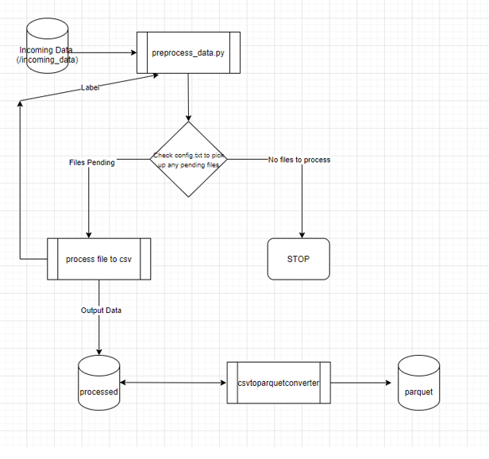
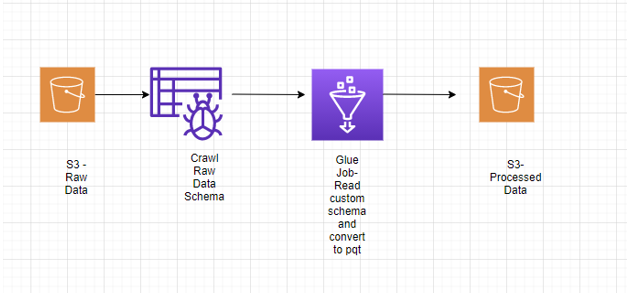

# CSV To Parquet

You are tasked with integrating a new cargo container datasource from a provider. 
This dataset contains rows of information about different shipments that are occurring, with details about the goods being transferred to and from a specific country.

THe project has a few rows of sample data (under ./incoming_data) for a specific country, alongside a file 
with the schema (schema.png). 
	
Aim:
	
	* Working with the data in the current format is very difficult. The goal of the exercise is to write out the data to a parquet file format that can be easily read by Apache Spark. This file would need to include column headers.
	
This must be done in the context of the following:

	* The size of a single file is very large (>50GB). You can imagine that you have access to a computing cluster.
	* The format of this file is unconventional and helper methods for reading it in libraries such as Python, Pandas and Spark may not work.
	* There is a large amount of historical data to process (>3TB), so making this process as efficient as possible is extremely important.
	* There will be heterogenous datasets for different countries, each with their own schema - so your solution should allow room for this.

# Prelude

On initial analysis this task seems best fit for a pyspark job which should be able to read the data and do a quick conversion to parquet. 
Issues with using Pyspark:
1)	The custom file format makes it difficult to use out of box pyspark.sql DataFrames  (df.read.csv) -> this function does accept custom record delimiter and column delimiter. But this can not be used as csv supports record delimiter of length 1 but custom delimiter is -  ‘#@#@#’ 

2)	Could use the RDD structure where we can apply lambda to break the file based on our requirements, but this is not going to be the most performant efficient way. Sample code to achieve this via RDD

```
rdd1= (sc.sparkContext
       .textFile("./sample_data.txt",10)
       .flatMap(lambda line: line.split("#@#@#"))
       .map(lambda x: x.split("~"))
       .filter(lambda x: len(x) > 1)
      )
```

	
# Final Design

The requirement will be best catered by using a hybrid solution of Python and Pyspark.
Below are the two steps of the flow

## Step 1 - Preprocess the file 

In this step we pick up the raw file from the ‘incoming data’ folder and process it to adhere to a 
generic csv file (columns are ‘,’ separated and records are ‘\n’ separated). 
Also we can use multiprocessing to increase performance. Along with this we run the preprocess script on all 
nodes in the cluster, each node can pick up the files pending for processing by using metadata 
information stored in config.txt . This file is kept up to date with information on the state of 
each file which has to be migrated. The final csv file is then place under ‘processed’ folder.

## Step 2 – Convert to Parquet
This python script polls on the master node waiting for files to be added to ‘processed’  
folder (picks up files starting with string con*) once it detects a new file picks up the file and 
uses Pyspark to convert the csv to parquet. 
The final result is put into the ‘parquet’ folder , the csv file post migration is renamed to
‘bkp_filename’ so that it gets ignored from the next run. 

## Flow Chart


 


Assumptions:
	Have hardcoded local folder values for testing on local we can replace these with hdfs or 
s3 based on file system being used. Based on that the file-locking mechanism might have to be changed.


Performance Testing Baseline:
Tested the solution with 25gb input file and end to end run time is approx. ~~ 6 mins. Taking a linear approach approx. time for 50gb file ~ 12 mins.

AWS Serverless Solution
Below flow chart shows a possible serverless solution for this requirement by using Glue ETL

 

Other Possible Solutions 

	Could consider using Hive or Athena to solve this issue via using create table, this is constricted as the schema of the files is not clear

	Use Hadoop streaming to run step 1 on the cluster on multiple nodes instead of the current approach ,this would require to put a screening logic to segregate the incoming files based on the country to different folders.


 
